<p align="center">
  <strong>Black-box web application penetration test</strong><br>
  <sub>Authorized educational security assessment</sub>
</p>

<p align="center">
  
  
</p>
<p align="center">
  
  
  
  
</p>

 **Overall risk rating: CRITICAL.** This controlled assessment identified an attack path from a public-facing login page to confidential patient documents, staff financial records, and corporate ownership information.

##  Project overview

This repository documents a black-box penetration test of the Mediroza General Hospital web infrastructure at `https://medirozahospital.com`. The assessment was performed for the Networkwalks B082 Week 4 Capstone Project to identify weaknesses, demonstrate their impact through controlled exploitation, and recommend practical remediation.

Seven findings, ranging from **Medium** to **Critical**, were identified. The central issue was a SQL injection vulnerability in the patient portal login flow. In the authorized test environment, it enabled authentication bypass, access to confidential patient lab-report PDFs, discovery of sensitive PDF metadata, and retrieval of an exposed database backup containing staff salary and shareholder information.

##  Objectives

- Assess the web application from an external, unauthenticated perspective.
- Identify weaknesses in authentication, input handling, file protection, and server configuration.
- Demonstrate the real-world impact of each finding in a controlled manner.
- Document evidence and provide prioritized remediation recommendations.

##  Authorization and scope

Testing was conducted with written authorization from the client as part of a controlled Networkwalks educational exercise.

| In scope | Excluded from scope |
| --- | --- |
| `https://medirozahospital.com` | Social engineering |
| Public facing web application behavior | Denial of service testing |
| Patient portal and discovered web paths within the agreed domain | Any testing outside the agreed domain |

##  Methodology

The assessment followed a structured black box methodology:

1. **Reconnaissance** - Passive information gathering using publicly available information and web-based tools.
2. **Vulnerability identification** - Analysis of application behavior for authentication and input-handling weaknesses.
3. **Controlled exploitation** - Demonstration of each issue's impact within the authorized environment.
4. **Documentation** - Recording of findings, evidence, and remediation recommendations.

##  Tools used

| Tool | Purpose in the assessment |
| --- | --- |
| cURL | Sending HTTP requests and reviewing web-server responses |
| Browser Developer Tools | Inspecting page source and login-form behavior |
| Networkwalks Hash Calculator | Extracting PDF password hashes |
| Networkwalks Password Cracker | Testing PDF password hashes against wordlists |
| QPDF | Decrypting password-protected PDFs after password recovery |
| ExifTool | Reading hidden metadata from PDFs |
| Wget | Downloading files from the web server in the controlled test |
| ChatGPT | Converting raw SQL data into readable tables during analysis |

##  Executive summary

The target's security posture was assessed as poor. A chain of individually preventable weaknesses enabled an unauthenticated attacker to progress from reconnaissance to patient-document access and, ultimately, access to a database backup exposed through a publicly listed directory.

The database extract contained sensitive information for **30 hospital employees** and ownership information for **10 shareholders**. To protect privacy, this README intentionally does not reproduce names, contact details, national ID numbers, salary figures, or ownership percentages from that extract.

Immediate remediation is recommended for all Critical and High findings.

##  Findings summary

| ID | Finding | Location | Risk |
| --- | --- | --- | --- |
| F-01 | Username enumeration on login page | `patient/login.php` | 🟡 Medium |
| F-02 | SQL injection login bypass | `patient/login.php` | 🔴 Critical |
| F-03 | Encrypted PDFs accessible after login bypass | `patient/reports/` | 🟠 High |
| F-04 | Weak PDF passwords crackable with a wordlist | `patient_report_*.pdf` | 🟠 High |
| F-05 | Sensitive metadata left in patient PDF files | `patient_report_3.pdf` | 🟡 Medium |
| F-06 | Forgotten backup folder with directory listing enabled | `old/` | 🔴 Critical |
| F-07 | Confidential staff salaries and shareholder data in plain text | `old/mediroza_db_backup_2019.sql` | 🔴 Critical |

##  Detailed findings

### F-01 - Username enumeration on login page

**Risk:** 🟡 Medium  
**Location:** `patient/login.php`

The patient login page returned different error messages for an unknown username and an incorrect password. This behavior allowed the assessor to confirm that a default administrative username existed, reducing the effort required for a password or authentication attack.

**Recommendation:** Return one generic failed-login response for every unsuccessful attempt, such as `Invalid credentials. Please try again.`

**Evidence placeholder:**


### F-02 - SQL injection login bypass

**Risk:** 🔴 Critical  
**Location:** `patient/login.php`

The login form appeared to place user-controlled input directly into a database query. A controlled test produced a MySQL syntax error, confirming that the field was injectable. The assessment then demonstrated that the password check could be bypassed and an administrative session obtained without valid credentials.

**Recommendation:** Replace dynamic query construction with parameterized queries or prepared statements. This is the most important remediation in this report.

### F-03 - Confidential PDFs accessible after login bypass

**Risk:** 🟠 High  
**Location:** `patient/reports/`

After the controlled authentication bypass, the patient portal exposed three downloadable patient lab-report PDFs. These documents should be accessible only to the named patients and authorized clinicians.

**Recommendation:** Store files outside the web root and deliver them only through server-side authorization checks.

**Evidence placeholder:**


### F-04 - Weak PDF passwords crackable with a wordlist

**Risk:** 🟠 High  
**Affected assets:** `patient_report_*.pdf`

All three PDFs were password protected, but the passwords were weak and present in commonly available wordlists. Two reports were recovered with the built-in 100-word list, while the third required a larger John the Ripper default password list. Password protection did not provide meaningful security for the medical documents.

**Recommendation:** If passwords are retained, enforce a minimum length of 12 characters with uppercase, lowercase, numbers, and symbols. Access control should remain server-side rather than relying on document passwords alone.

**Evidence placeholder:**


### F-05 - Sensitive metadata in patient PDF files

**Risk:** 🟡 Medium  
**Affected asset:** `patient_report_3.pdf`

After decryption, metadata analysis identified an internal staff comment that referenced a database backup location on the server. The information was not visible in the document's normal reading view but was extractable with metadata tooling.

**Recommendation:** Remove metadata before distributing files. Internal notes and staff comments must never remain in documents that leave the organization.


### F-06 - Forgotten backup folder with directory listing enabled

**Risk:** 🔴 Critical  
**Location:** `old/`

Reconnaissance identified `/old` in `robots.txt`; the metadata clue confirmed its relevance. The directory had listing enabled and exposed a database backup file to anyone visiting the URL. The backup was downloaded during the authorized test.

**Recommendation:** Disable directory listing (for example, with `Options -Indexes` in Apache configuration or `.htaccess`), remove the backup from the web root immediately, and store backups only in private, access-controlled locations.


### F-07 - Confidential staff salaries and shareholder data in plain text

**Risk:** 🔴 Critical  
**Affected asset:** `old/mediroza_db_backup_2019.sql`

The exposed database backup contained plain-text staff and shareholder information. The staff data included employee names, roles, contact information, national IDs, and monthly salaries; the shareholder data included names, percentages, and share classes. This README deliberately summarizes the exposure rather than reproducing the sensitive records.

**Recommendation:** Remove the publicly accessible backup, protect stored backups with strict access controls, and review backup handling, retention, and encryption practices.

**Evidence placeholder:**


##  Attack-chain walkthrough

The following sequence shows how the findings combined into a complete exposure path:

1. `robots.txt` revealed three hidden paths: `/patient`, `/staff`, and `/old`.
2. The patient login page disclosed different error messages, confirming a valid administrative username (**F-01**).
3. A malformed username input triggered a database error, confirming injectable input handling (**F-02**).
4. Controlled SQL injection bypassed the login and provided access to the patient portal (**F-02**).
5. Three confidential patient lab-report PDFs were downloaded from the portal (**F-03**).
6. Wordlist attacks recovered the weak PDF passwords; the third report required a larger John the Ripper default list (**F-04**).
7. Metadata analysis of the unlocked third PDF revealed a staff comment pointing to `/old` (**F-05**).
8. Directory listing on `/old` exposed the database backup (**F-06**).
9. The backup exposed plain-text records for 30 employees and 10 shareholders (**F-07**).

```text
Reconnaissance -> Username Enumeration -> SQL Injection -> Portal Access
       -> Patient PDFs -> Weak PDF Passwords -> Metadata Disclosure
       -> Directory Listing -> Exposed Database Backup
```

```mermaid
flowchart LR
    A[Reconnaissance] --> B[Username Enumeration]
    B --> C[SQL Injection]
    C --> D[Patient Portal Access]
    D --> E[Confidential PDFs]
    E --> F[Weak PDF Passwords]
    F --> G[Metadata Disclosure]
    G --> H[Directory Listing]
    H --> I[Exposed Database Backup]

    classDef discovery fill:#dbeafe,stroke:#2563eb,color:#111827
    classDef critical fill:#fee2e2,stroke:#dc2626,color:#111827
    classDef high fill:#ffedd5,stroke:#ea580c,color:#111827
    classDef exposure fill:#f3e8ff,stroke:#7e22ce,color:#111827

    class A,B discovery
    class C,D,H critical
    class E,F,G high
    class I exposure
```



##  Impact

If exploited outside the controlled environment, this chain could enable an unauthenticated attacker to:

- Access confidential patient medical documents.
- Recover weakly protected PDF contents.
- Discover internal infrastructure clues through document metadata.
- Obtain exposed database backups.
- Access sensitive staff financial and personal information.
- Access corporate ownership information.

The combined effect is a serious confidentiality breach with potential privacy, regulatory, financial, and reputational consequences.

##  Remediation priorities

| Priority | Action |
| --- | --- |
| 🔴 Immediate | Replace vulnerable login queries with prepared statements / parameterized queries. |
| 🔴 Immediate | Remove the database backup from the web root and disable directory listing. |
| 🔴 Immediate | Review and revoke any exposed credentials or sessions; assess the scope of potential data exposure. |
| 🟠 High | Move patient PDFs outside the web root and enforce server-side authorization before delivery. |
| 🟠 High | Strengthen PDF-password requirements where passwords remain necessary. |
| 🟡 Medium | Strip PDF metadata before external distribution. |
| 🟡 Medium | Standardize generic failed-login responses to prevent username enumeration. |

##  Evidence gallery


| Evidence | Suggested file |
| --- | --- |
| Scope and authorization | `docs/evidence/00-authorization-and-scope.png` |
| Username enumeration | `docs/evidence/f01-username-enumeration.png` |
| SQL injection confirmation / controlled bypass | `docs/evidence/f02-sql-injection-login-bypass.png` |
| Patient-report access | `docs/evidence/f03-patient-report-access.png` |
| PDF password assessment | `docs/evidence/f04-weak-pdf-passwords.png` |
| PDF metadata finding | `docs/evidence/f05-sensitive-pdf-metadata.png` |
| Directory-listing exposure | `docs/evidence/f06-directory-listing-backup.png` |
| Redacted database-exposure proof | `docs/evidence/f07-redacted-database-exposure.png` |


##  Full report

[Mediroza Penetration Testing Report.pdf](https://github.com/user-attachments/files/32076421/Mediroza.Penetration.Testing.Report.pdf)

##  Lessons learned

- Small security flaws can combine into a high-impact attack chain.
- Authentication errors and database errors reveal valuable information to attackers.
- Encryption is ineffective when document passwords are weak and easily guessed.
- Document metadata requires the same security review as visible content.
- Backups must never be placed in publicly accessible web directories.
- Defense in depth is essential: secure input handling, authorization, file storage, server configuration, and data governance must all work together.

##  Conclusion

This assessment demonstrated a complete path from the login page to highly sensitive internal data using well-known, preventable weaknesses. Critical and High findings should be addressed immediately before the system is used to store or serve real patient data.

##  Disclaimer

This project was produced as part of a controlled educational exercise by Networkwalks. The target was authorized for security testing, and all activity was performed within the agreed scope. The techniques described here must never be used against systems without explicit written permission from the owner.

## 👤 Credits

- **Author:** Alebiosu Oluwadamilare Samuel
- **Cybersecurity Mentor:** Waqas Karim, CCIE
- **Organization:** Networkwalks
- **Program:** B082 Cybersecurity Internship - Week 4 Capstone Project

---

<p align="center">
  
</p>


